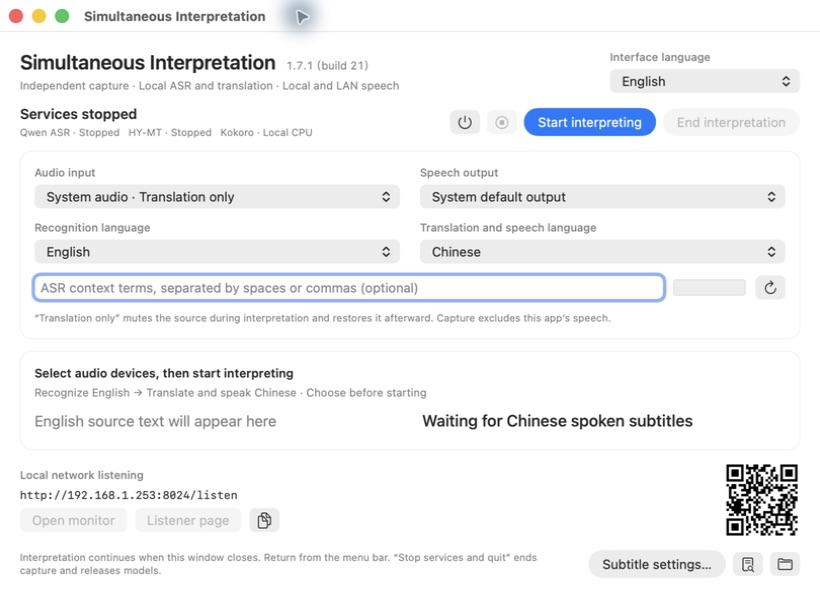

# VoxHalo · Simultaneous Interpretation

**English** | [简体中文](README.zh-CN.md)

### Language should never stand in the way of human connection.

**VoxHalo is a fully local, free, open-source simultaneous interpretation system with a goal of connecting people across every language. Once installed, speech recognition, translation, spoken output and subtitles work on your Mac without an internet connection.**

We want people to express themselves in the language they know and understand voices from another language. In classrooms, meetings and everyday conversations, language should help people connect.

Today, VoxHalo runs independently on **Apple Silicon Macs**, supporting **8 languages and 56 translation directions** through speech recognition, translation, spoken output and synchronized subtitles. Coverage of every language is our long-term goal. We will add languages as their recognition, translation, speech synthesis and local performance are validated.

**Current App: 1.8.0 · build 22** · **Maintainer: [hellcatjack](https://github.com/hellcatjack)**

[Download App](https://github.com/hellcatjack/VoxHalo_mac/releases/latest) · [Graphical installation](docs/en/QUICKSTART.md) · [Models](docs/en/MODELS.md) · [Language validation](docs/en/EIGHT-LANGUAGES.md) · [Changelog](CHANGELOG.en.md) · [Report an issue](https://github.com/hellcatjack/VoxHalo_mac/issues)

## The App



The native macOS console, shown idle with the English interface.

## Fully local deployment. Interpretation works offline.

Audio capture, Qwen recognition, HY-MT translation, Kokoro speech and desktop subtitles all run locally. **After models and dependencies are installed, interpretation of microphone speech or local audio/video requires no internet connection, cloud account, API key or remote server.**

| Scenario | Network requirement |
|---|---|
| Initial installation, model downloads or dependency updates | Internet required; installed assets remain on your Mac |
| Recognition, translation, speech and subtitles for microphone/local media | No internet or LAN required |
| Browser monitoring on the same Mac | Uses a local loopback address; no internet required |
| Listening from phones/tablets | A reachable LAN shared with the Mac; no internet required |
| YouTube and other online video | The video source needs internet; interpretation inference remains local |

Missing local model files produce an error instead of a cloud inference fallback. Browser monitoring is optional; the native App independently runs interpretation.

## Why VoxHalo exists

- **Free to use.** Application source is public, with no software subscription or per-minute inference charge from the project. No paid cloud API is needed. You provide your own hardware; models and dependencies retain their respective licenses.
- **Local first.** Recognition, translation and speech synthesis run on your Mac. Once models and dependencies are installed, inference can work offline.
- **More people can take part.** Speakers can use a familiar language while listeners follow translated speech and subtitles. Phones and tablets on the same local network can join the audio stream.
- **Language coverage that grows.** We enable complete recognition, translation and speech workflows, publish validation results and known limitations, and invite speakers of different languages to help improve them.

## The 8 supported languages

Every language below can be the **spoken input language** or the **translation and speech target**, and has a corresponding App and web interface.

| Language | Native name | Code | Speech recognition | Translation and speech | Interface |
|---|---|---|---|---|---|
| Chinese | 中文 | `zh` | Supported | Supported | Supported |
| English | English | `en` | Supported | Supported | Supported |
| Japanese | 日本語 | `ja` | Supported | Supported | Supported |
| French | Français | `fr` | Supported | Supported | Supported |
| Spanish | Español | `es` | Supported | Supported | Supported |
| Italian | Italiano | `it` | Supported | Supported | Supported |
| Portuguese | Português | `pt` | Supported | Supported | Supported |
| Hindi | हिन्दी | `hi` | Supported | Supported | Supported |

Each language can be translated into the other seven: **8 × 7 = 56 directions**. Chinese ↔ English, English ↔ Japanese, French ↔ Chinese and Portuguese ↔ Hindi all use the same interpretation workflow. Choose one source and one target before starting; each session runs that direction, and LAN listeners hear the same target-language speech.

Interface language is independent, follows system/browser preferences by default, and remembers manual choices. The Chinese interface uses Simplified Chinese; Portuguese speech uses a Brazilian voice. All eight language workflows are connected, while accuracy and accent coverage still need separate evaluation. See [eight-language validation and limitations](docs/en/EIGHT-LANGUAGES.md).

## What you can do

- **Follow videos, classes and online meetings.** Capture the audio playing on your Mac. Translation-only mode suppresses source playback during interpretation and sends translated speech to your headphones or speakers.
- **Translate live speech.** Select the default input or a specific microphone/audio interface, then continuously recognize and translate incoming speech.
- **Read while you listen.** Desktop subtitles follow actual local speech playback. Adjust font, size, color, shadow, display, position and width, including placement over the Dock. The current source adds [global subtitle shortcuts for presentations](docs/en/SUBTITLE-SHORTCUTS.md).
- **Invite listeners on the same network.** The App detects your LAN IP and provides an address and QR code. Phones and tablets can scan it to hear the shared translation stream.
- **Run interpretation entirely from the App.** Native controls handle devices, direction, start and stop. The browser monitor displays text and status; closing it does not interrupt interpretation.

Speech supports continuous playback and automatic catch-up. Chinese synthesis favors complete sentences, with an automatic speed range of **1.10–1.30×**. Committed speech and its subtitles stay aligned; a newer translation does not replace a sentence that is still being spoken.

## Models and acceleration

| Stage | Current model | Local runtime |
|---|---|---|
| Speech recognition | [Qwen3-ASR-0.6B](https://huggingface.co/Qwen/Qwen3-ASR-0.6B), 0.6B model variant | MLX INT8, Metal GPU acceleration |
| Text translation | [HY-MT1.5-1.8B](https://huggingface.co/tencent/HY-MT1.5-1.8B), 1.8B parameters | Q8_0 GGUF, llama.cpp, Metal GPU acceleration |
| English, Japanese, French, Spanish, Italian, Portuguese and Hindi speech | [Kokoro-82M v1.0](https://huggingface.co/hexgrad/Kokoro-82M), approximately 82M parameters | Shared ONNX model, CPU synthesis |
| Chinese speech | [Kokoro-82M v1.1-zh](https://huggingface.co/hexgrad/Kokoro-82M-v1.1-zh), approximately 82M parameters | ONNX, male voice `zm_029`, floating-point speed support |
| Voice activity detection | Silero VAD ONNX | CPU, assists pause and sentence-boundary handling |

Recognition and translation coordinate GPU execution; TTS uses two CPU threads. Acceleration currently uses the **Metal GPU**, without Apple Neural Engine deployment. Translation is served by a local llama.cpp process, with no OpenAI or other cloud inference service required.

Installation downloads approximately **4.61 GB** of models and prebuilt speech components; the desktop App already includes its main Python/AI runtime. The Chinese speed repair creates an additional model of about **344 MB**. Exact versions, prompts, voices, checksums and licenses are documented in the [model guide](docs/en/MODELS.md).

## Minimum Mac configuration

**Recommended trial starting point: Apple M1, 16 GB unified memory, macOS 14.2+, and 20 GB free storage.** This is an engineering estimate. The complete system has been validated on a **MacBook Air M4 / 24 GB / macOS 26**.

| Item | Requirement or recommendation |
|---|---|
| Processor | Apple Silicon M1 or later, native `arm64`; the installer does not support Intel Macs or Rosetta/x86 environments |
| Memory | Desktop installer requires 16 GB; 24 GB or more for regular use; sustained real-time performance at 16 GB needs validation |
| macOS | 14.2+ for the complete feature set; older OS versions and M-series machines need their own validation |
| Storage | Reserve 20 GB for models, dependencies, download caches and temporary files |
| Build tools | None for the desktop release; Xcode Command Line Tools only for source builds |
| Network | Internet for initial installation; inference can run offline; online videos and LAN listeners need their respective network connections |

Earlier M-series Macs, 16 GB configurations and macOS 14/15 have not completed the project's full installation and endurance validation. Successful model loading does not guarantee sustained real-time performance. See [compatibility evidence](docs/en/INSTALLATION.md#compatibility-evidence) for tested environments and check commands.

## Installation — no Terminal required

1. Download **VoxHalo-1.8.0-macOS-arm64.dmg** from [GitHub Releases](https://github.com/hellcatjack/VoxHalo_mac/releases/latest). Choose the desktop asset, not “Source code”.
2. Open the DMG and drag **同声传译.app** into **Applications**.
3. Open the App, review the model licenses, and install the models in its first-run window. Progress, cancellation and retry are built in; completed verified downloads are reused.
4. Choose your input, output and language direction, then click **Start interpreting**. Allow the required macOS audio permission when prompted.

**The desktop App includes its Python/AI runtime.** No Xcode, Homebrew, Docker, separate Python or cloud API key is required. Models and prebuilt speech components download once into **~/Library/Application Support/VoxHalo/**; after installation, interpretation works offline. Copying the App to another Mac starts a fresh local setup there.

This release is **ad-hoc signed, without Apple Developer ID notarization**. macOS may require you to allow this App through **System Settings → Privacy & Security → Open Anyway** after its first blocked launch. See the [complete installation steps and troubleshooting](docs/en/QUICKSTART.md) and [Apple's instructions](https://support.apple.com/en-us/102445). Do not disable your Mac's general security protections.

Developers can continue using `./setup.sh` and the [source installation guide](docs/en/INSTALLATION.md). Existing source installations remain independent of the managed desktop runtime.

## Start your first interpretation session

1. Choose **Audio input** and **Speech output** in the App.
2. Select **Recognition language** and **Translation and speech language**, such as English → Chinese.
3. Optionally enter a few ASR context terms for names or specialist vocabulary.
4. Click **Start interpreting**, wait for capture to begin, then speak or play the source audio.
5. Open **Subtitle settings…**, the monitor, or the LAN QR code as needed.
6. Pause the source before clicking **End interpretation**. Use **Stop services** to unload models, or **Stop services and quit** from the menu to exit completely.

**Hear only translated video audio:** select **System audio · Translation only** and your headphones or default output. Keep the video itself audible; the App handles source suppression during capture. Source playback returns when interpretation ends. Capture includes other applications' system sound, so pause unrelated audio sources.

**Microphone input:** headphones help prevent speaker audio from feeding back into the microphone. System-audio modes exclude this App's own speech.

**Change languages or devices:** end the current session before changing input, output or interpretation direction. Interface language can change during a session. Hover over auxiliary icons to see their action names.

**Monitor and listeners:** the local monitor is at `http://127.0.0.1:8024`. Other devices use the App's LAN address or QR code and start listening on the listener page. Phone HLS buffering can differ from native Mac playback latency. Closing the main window keeps interpretation running; return through the menu-bar icon.

## Where we are and where we want to go

| Available today | What we want to develop next |
|---|---|
| Eight-language recognition, translation and speech, with 56 directions | Broader coverage across the complete speech workflow |
| Local Apple Silicon operation | Lower resource requirements and validation on more Macs |
| Native App, eight interface languages, synchronized subtitles and LAN listening | Continued usability and accessibility improvements |
| Chinese/English long-audio validation and short samples for other languages | More native-speaker reviews, accents, noise conditions and endurance tests |

These are project goals. The current language catalog and release notes define what is available now. Share your language, use case and samples you are permitted to publish to help guide the next steps.

## Quality, latency and validation

Interpretation works with stable short phrases to balance accuracy and waiting time. The current Qwen path repeatedly decodes bounded audio windows. Recognition, sentence confirmation, translation, synthesis and queueing each add latency.

- Chinese/English directions have undergone ten-minute-scale continuous tests with real audio. The six added languages have primarily short-sample validation; equivalent accuracy across languages has not been established.
- Names, accents, noise, mixed languages and complex sentences can still cause recognition or translation errors. Prompts and terminology policies are described in the [model guide](docs/en/MODELS.md).
- Later revisions to a sentence already heard do not automatically replay every correction. The monitor can distinguish spoken text from revised translations.
- One active audio input and one source/target pair are supported at a time. Phones and the Mac share translated content, without a sample-level synchronization guarantee.

See [eight-language validation](docs/en/EIGHT-LANGUAGES.md), [speech and caption consistency](docs/en/SPEECH-CONSISTENCY.md) and the [changelog](CHANGELOG.en.md) for detailed results.

## Privacy and networking

Recognition, translation and synthesis run locally. Once installed, the system does not send audio to a cloud service for inference. Debug-file recording of source audio is disabled by default; runtime logs and explicitly generated diagnostics may contain text, so remove private information before sharing them.

LAN features make monitoring text and translated audio available to devices that can reach the service. The default Mac profile listens on `0.0.0.0:8024` without web login enabled; use a trusted network. The internal translation service binds only to `127.0.0.1:8876`. Do not publish local control credentials, private recordings or `VoxBridge/artifacts/macos-service/`.

## Documentation and contributing

| Guide | Contents |
|---|---|
| [Desktop installation](docs/en/QUICKSTART.md) | Download, graphical model setup, permissions, updates and removal |
| [Source installation](docs/en/INSTALLATION.md) | Developer setup, verification and maintenance |
| [Models and licenses](docs/en/MODELS.md) | Models, quantization, voices, prompts and third-party licenses |
| [Interface languages](docs/en/INTERFACE-LANGUAGES.md) | Eight-language interfaces and automatic/manual selection |
| [Eight-language validation](docs/en/EIGHT-LANGUAGES.md) | Tested capabilities, scope and limitations |
| [Speech and caption consistency](docs/en/SPEECH-CONSISTENCY.md) | Committed speech, synchronized captions and later corrections |
| [Architecture](docs/en/ARCHITECTURE.md) | Reusable modules, language policies and output interfaces |

Contributions through [issues](https://github.com/hellcatjack/VoxHalo_mac/issues) and [pull requests](https://github.com/hellcatjack/VoxHalo_mac/pulls) are welcome, especially native-speaker feedback on translations, pronunciation and interface wording. Include the version, Mac configuration, input/output modes, language direction, reproduction steps and sanitized logs. Send sensitive reports to [hellcatjack@gmail.com](mailto:hellcatjack@gmail.com).

Read [AGENTS.md](AGENTS.md) before development. After installation, run from the repository root:

```sh
./macos.sh check
cd VoxBridge
../.venv/bin/python -m pytest -q
cd ..
./build-app.sh --destination "$PWD/dist/同声传译.app"
```

Maintain English and Chinese documentation together. Keep models, media, virtual environments, logs and credentials out of Git.

## License and acknowledgments

Application source is licensed under [Apache-2.0](LICENSE). **The project's goal of free access does not change third-party model and dependency license conditions.** HY-MT uses the Tencent HY Community License, whose territory excludes the EU, UK and South Korea and which includes other use/distribution conditions. Before installing or deploying it, read the [complete license for the pinned model](https://huggingface.co/tencent/HY-MT1.5-1.8B-GGUF/blob/265b2e615a7dc9b06c435dc878829ad99a512ba2/License.txt) and the [model license guide](docs/en/MODELS.md#licenses-and-attribution).

VoxHalo is independently maintained by **hellcatjack**, with no Tencent affiliation, sponsorship or endorsement. Thanks to Qwen, Tencent Hunyuan, MLX, llama.cpp, Kokoro, ONNX Runtime, sherpa-onnx, Silero VAD and the other upstream projects that make local interpretation possible.
