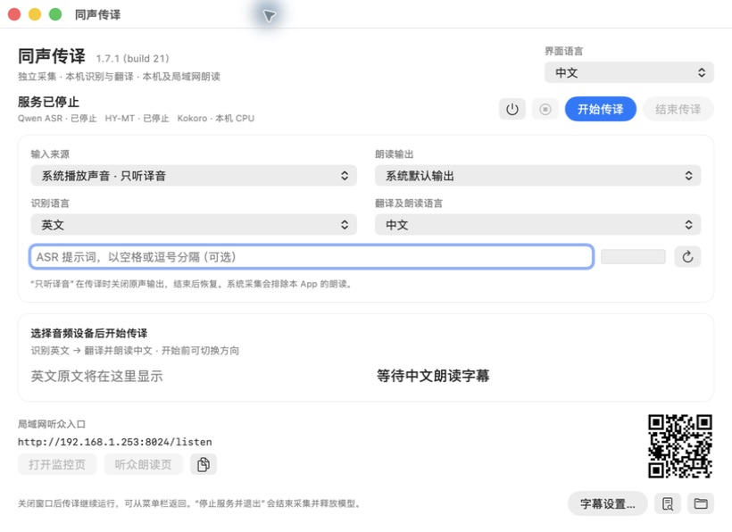
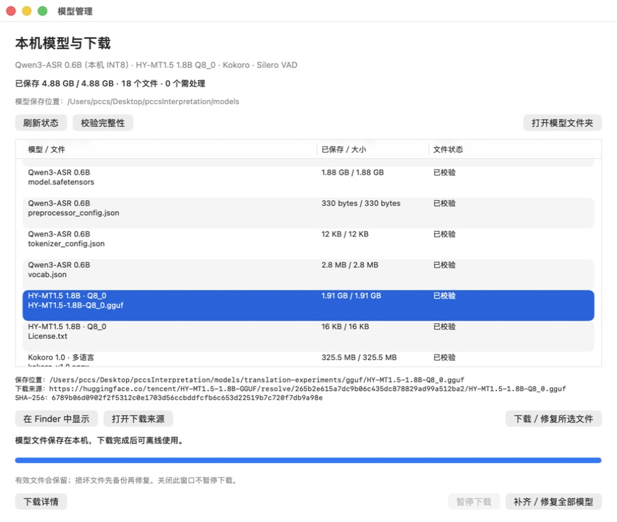
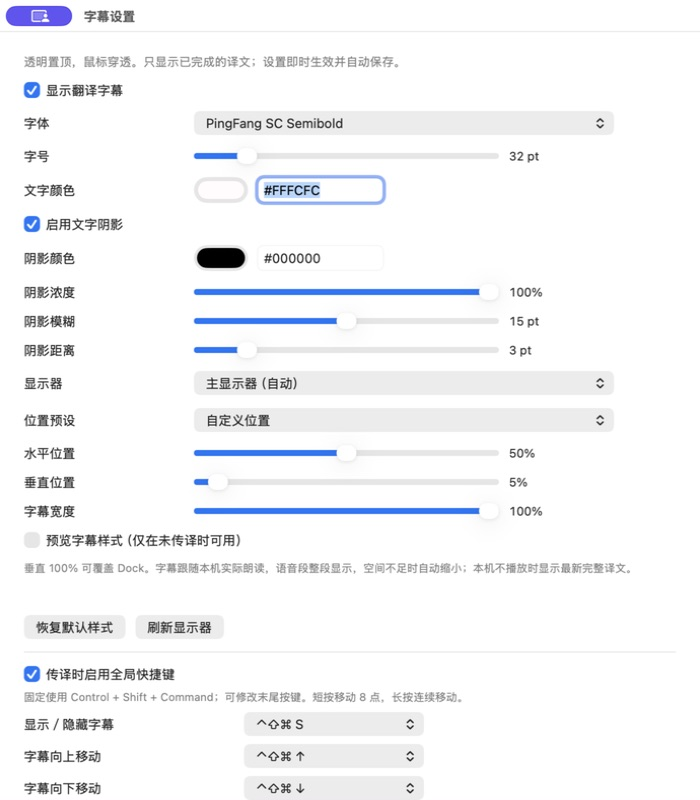

# VoxHalo · 同声传译

[English](README.md) | **简体中文**

### 人类不应该让语言限制互相的沟通。

**VoxHalo 是一个全面本地部署、以免费和全语言互通为目标的开源同声传译系统。安装完成后，无需联网即可在本机完成语音识别、翻译、朗读与字幕显示。**

我们希望每个人都能用熟悉的语言表达自己，也能听懂来自另一种语言的声音。从课堂、会议到日常交流，语言应该帮助人与人建立联系。

目前，VoxHalo 在 **Apple Silicon Mac** 上独立运行，支持 **8 种语言、56 个互译方向**，将语音识别、翻译、译音朗读与同步字幕连接成一套完整系统。全语言覆盖是项目的长期目标；我们会在识别、翻译、朗读和本机运行表现经过验证后，逐步开放更多语言。

**最新可下载安装包：1.8.0 · build 22** · **当前源码／本地 App：1.8.2 · build 24** · **维护者：[hellcatjack](https://github.com/hellcatjack)**

[下载 App](https://github.com/hellcatjack/VoxHalo_mac/releases/latest) · [图形安装指南](docs/zh-CN/QUICKSTART.md) · [模型说明](docs/zh-CN/MODELS.md) · [语言验证](docs/zh-CN/EIGHT-LANGUAGES.md) · [版本记录](CHANGELOG.md) · [反馈问题](https://github.com/hellcatjack/VoxHalo_mac/issues)

## App 界面



原生 macOS 控制台，截图为中文界面的空闲状态。

### 模型管理



在 App 内直接查看每个模型的文件名、已保存大小、状态、保存位置、下载来源与 SHA-256。示例中的 **18 个文件全部校验通过**，共占用 **4.88 GB**。误删文件后，停止服务即可重新下载所选文件，也可一次补齐／修复全部缺失或损坏的文件。下载支持进度显示、暂停与续传，详见[模型管理指南](docs/zh-CN/MODEL-MANAGEMENT.md)。

### 字幕设置



可调整字幕字体、字号、文字与阴影颜色、阴影强度、显示器、位置和宽度。向下滚动可自定义[放映快捷键](docs/zh-CN/SUBTITLE-SHORTCUTS.md)，控制字幕显示、隐藏和上下移动。字幕控制独立于实际朗读。

以上两张设置截图来自本地 **1.8.2 · build 24** App。截图中的路径与样式是本次源码安装的示例，App 会显示用户实际的模型保存位置。**模型管理和放映快捷键已包含在当前源码／本地 App 中，已发布的 1.8.0 安装包尚未包含这些功能。**

## 全面本地部署，离线也能沟通

音频采集、Qwen 语音识别、HY-MT 翻译、Kokoro 朗读与桌面字幕都在本机完成。**安装好模型与依赖后，使用麦克风或本地音视频进行传译不依赖互联网、云端账号、API 密钥或远程服务器。**

| 场景 | 网络需求 |
|---|---|
| 首次安装、下载模型或更新依赖 | 需要互联网；安装后的资源保存在本机 |
| 麦克风讲话、本地音视频的识别、翻译、朗读和字幕 | 无需互联网，也无需局域网 |
| 同一台 Mac 上的浏览器监控 | 通过本机回环地址访问，无需互联网 |
| 手机／平板收听译音 | 需要与 Mac 处于可互通的局域网，无需互联网 |
| YouTube 等在线视频 | 视频来源需要互联网；传译推理仍在本机进行 |

安装后本地模型缺失会报错，不会自动转向云端推理。浏览器监控是可选项，原生 App 独立负责传译。

## 为什么做 VoxHalo

- **免费使用。** 项目公开应用源码，不收取软件订阅或按时长计费的推理费用，无需购买云端 API。用户使用自己的设备，模型与依赖遵循各自许可证。
- **本机优先。** 语音识别、翻译和合成都在 Mac 上完成。模型与依赖安装完成后，推理可以离线运行。
- **让更多人参与。** 说话者可以使用熟悉的语言，听众可以通过译音和字幕理解内容。同一局域网中的手机和平板也能加入收听。
- **持续扩展语言覆盖。** 以完整的识别、翻译、朗读体验为单位开放语言，公开验证结果与已知限制，邀请不同语言的使用者共同改进。

## 当前支持的 8 种语言

下列每一种语言都可以作为**语音输入语言**或**翻译与朗读的目标语言**，并提供对应的 App 和网页界面。

| 语言 | 本地名称 | 代码 | 语音识别 | 翻译与朗读 | 界面 |
|---|---|---|---|---|---|
| 中文 | 中文 | `zh` | 支持 | 支持 | 支持 |
| 英文 | English | `en` | 支持 | 支持 | 支持 |
| 日语 | 日本語 | `ja` | 支持 | 支持 | 支持 |
| 法语 | Français | `fr` | 支持 | 支持 | 支持 |
| 西班牙语 | Español | `es` | 支持 | 支持 | 支持 |
| 意大利语 | Italiano | `it` | 支持 | 支持 | 支持 |
| 葡萄牙语 | Português | `pt` | 支持 | 支持 | 支持 |
| 印地语 | हिन्दी | `hi` | 支持 | 支持 | 支持 |

每种语言可以翻译为其余 7 种语言，共 **8 × 7 = 56 个方向**。例如中文 ↔ 英文、英文 ↔ 日语、法语 ↔ 中文、葡萄牙语 ↔ 印地语，都使用同一套传译流程。开始前选择一个源语言和一个目标语言；一场会话按所选方向运行，局域网听众收听同一目标语言的译音。

界面语言独立设置，默认跟随系统或浏览器，并记住手动选择。中文界面采用简体中文，葡萄牙语朗读使用巴西口音。八种语言的链路均已接通，准确率和口音适应能力仍需分别评估；详见[八语言验证与限制](docs/zh-CN/EIGHT-LANGUAGES.md)。

## 你可以用它做什么

- **听懂视频、课程与线上会议。** 直接采集系统正在播放的声音；“只听译音”模式可在传译时抑制原声，并将译音送往耳机或扬声器。
- **翻译现场讲话。** 选择系统默认输入或指定麦克风、声卡，启动后持续识别并翻译。
- **边听边看字幕。** 桌面字幕跟随本机实际朗读。可调整字体、字号、颜色、阴影、显示器、位置与宽度，也能覆盖 Dock 区域。当前源码新增[放映时可用的字幕全局快捷键](docs/zh-CN/SUBTITLE-SHORTCUTS.md)。
- **让同一网络中的听众加入。** App 自动使用局域网 IP 生成地址和二维码。手机或平板扫码后即可收听共享译音。
- **在 App 中独立完成传译。** 选择设备、切换方向、开始和结束传译均由原生 App 完成；监控网页用于查看文本和状态，关闭网页不会中断业务。

朗读支持连续播放与积压追赶。中文优先整句合成，自动语速范围为 **1.10–1.30 倍**。已提交朗读的字幕与对应语音保持一致；后续到达的译文不会提前替换仍在朗读的句子。

## 模型与本机加速

| 环节 | 当前模型 | 本机运行方式 |
|---|---|---|
| 语音识别 | [Qwen3-ASR-0.6B](https://huggingface.co/Qwen/Qwen3-ASR-0.6B)，0.6B 型号 | MLX INT8，Metal GPU 加速 |
| 文本翻译 | [HY-MT1.5-1.8B](https://huggingface.co/tencent/HY-MT1.5-1.8B)，18 亿参数 | Q8_0 GGUF，llama.cpp，Metal GPU 加速 |
| 英、日、法、西、意、葡、印地语朗读 | [Kokoro-82M v1.0](https://huggingface.co/hexgrad/Kokoro-82M)，约 8,200 万参数 | 共享 ONNX 模型，CPU 合成 |
| 中文朗读 | [Kokoro-82M v1.1-zh](https://huggingface.co/hexgrad/Kokoro-82M-v1.1-zh)，约 8,200 万参数 | ONNX，男声 `zm_029`，支持浮点语速 |
| 语音活动检测 | Silero VAD ONNX | CPU，辅助识别停顿与句子边界 |

识别与翻译协调使用 GPU，TTS 使用两个 CPU 线程。当前加速路径为 **Metal GPU**，未使用 Apple Neural Engine。翻译接口由本地 llama.cpp 提供，无需 OpenAI 或其他云端推理服务。

安装器下载约 **4.61 GB** 模型及预编译语音组件；桌面版已内置主要 Python／AI 运行环境；中文语速修复会生成约 **344 MB** 的额外模型文件。具体版本、提示词、音色、校验值与许可证见[模型说明](docs/zh-CN/MODELS.md)。

## 最低 Mac 配置

**建议试用起点：Apple M1、16 GB 统一内存、macOS 14.2+、20 GB 可用空间。** 这是工程估算；目前完整系统的已验证配置为 **MacBook Air M4／24 GB／macOS 26**。

| 项目 | 要求或建议 |
|---|---|
| 芯片 | Apple Silicon M1 或更新，原生 `arm64`；安装器不支持 Intel Mac 或 Rosetta/x86 环境 |
| 内存 | 桌面安装器要求至少 16 GB；日常使用建议 24 GB 或以上；16 GB 持续实时表现仍需验证 |
| 系统 | 完整功能需要 macOS 14.2+；较旧系统与 M 系列机型仍需实机验证 |
| 存储 | 预留 20 GB，容纳模型、依赖、下载缓存和临时文件 |
| 构建工具 | 下载桌面版无需构建工具；仅源码构建需要 Xcode Command Line Tools |
| 网络 | 首次安装需联网；本地推理可离线；在线视频和局域网听众仍需相应网络 |

较早的 M 系列、16 GB 配置和 macOS 14/15 尚未完成项目的整套安装与长时间验收。模型能加载不代表一定能持续跟上实时语音。兼容性依据、已测环境和检查命令见[详细安装指南](docs/zh-CN/INSTALLATION.md#兼容性依据)。

## 安装：无需终端命令

1. 从 [GitHub Releases](https://github.com/hellcatjack/VoxHalo_mac/releases/latest) 下载 **VoxHalo-1.8.0-macOS-arm64.dmg**，请选择桌面安装包，而非“Source code”。
2. 打开 DMG，把**同声传译.app** 拖入**应用程序**。
3. 打开 App，在首次安装窗口阅读模型许可并安装模型。支持进度显示、取消和重试，已完成且校验通过的下载会复用。
4. 选择输入、输出及翻译方向，点击**开始传译**，并按提示授予所需音频权限。

**桌面版内置 Python 和主要 AI 运行环境**，无需 Xcode、Homebrew、Docker、单独安装 Python 或云端 API 密钥。模型和预编译语音组件首次下载到 **~/Library/Application Support/VoxHalo/**，之后可离线同传。把 App 复制到另一台 Mac 后，会在那台 Mac 上独立完成首次安装。

本版采用 **ad-hoc 签名，尚未通过 Apple Developer ID 公证**。macOS 首次拦截时，可能需要在**系统设置 → 隐私与安全性 → 仍要打开**中允许这一个 App。详见[完整图形安装指南](docs/zh-CN/QUICKSTART.md)和 [Apple 官方说明](https://support.apple.com/zh-cn/102445)，无需关闭整台 Mac 的安全保护。

开发者仍可使用 `./setup.sh` 和[源码安装指南](docs/zh-CN/INSTALLATION.md)。已有源码安装与桌面版的托管运行目录互相独立。

## 开始第一次传译

1. 在 App 中选择**输入来源**和**朗读输出**。
2. 选择**识别语言**与**翻译及朗读语言**，例如英文 → 中文。
3. 按需填写少量 ASR 提示词，帮助识别人名或专业词汇。
4. 点击**开始传译**，等待采集启动，再讲话或播放源音频。
5. 按需打开**字幕设置…**、监控页，或让听众扫描二维码。
6. 完成时先暂停源音频，再点击**结束传译**。卸载模型可用“停止服务”；完全退出可用菜单中的“停止服务并退出”。

**视频只听译音：**输入选择“系统播放声音 · 只听译音”，输出选择耳机或系统默认输出。保留视频本身的声音，App 在采集期间处理原声抑制；结束传译后原声会恢复。采集覆盖其他应用的系统声音，请暂停无关音源。

**麦克风：**建议搭配耳机，减少扬声器声音回流。系统声音模式会排除本 App 自己的朗读。

**语言与设备切换：**先结束当前传译，再更换输入、输出或传译方向。界面语言可以在运行中切换。辅助图标悬停时会显示操作名称。

**监控与听众：**本机监控地址为 `http://127.0.0.1:8024`；其他设备使用 App 显示的局域网地址或二维码，在听众页点击开始收听。手机 HLS 缓冲与 Mac 本机播放的延迟可能不同。关闭主窗口后传译仍会继续，可从菜单栏返回。

## 当前进展与未来方向

| 当前已经实现 | 接下来希望推进 |
|---|---|
| 八语言识别、翻译和朗读，56 个方向 | 扩大完整语音链路的语言覆盖 |
| Apple Silicon 本地运行 | 降低资源需求，验证更多 Mac 配置 |
| 原生 App、八语言界面、同步字幕、局域网听众 | 持续改善易用性与无障碍体验 |
| 中英长音频验证、其他语言短样本验证 | 增加母语者听评、多口音、噪声与长时间测试 |

这些方向是项目愿景，具体支持范围以当前语言目录和发布记录为准。欢迎分享你的语言、使用场景和可公开的测试样本，帮助我们确定下一步。

## 质量、延迟与验证

传译采用稳定短句，在准确性和等待时间之间取舍。当前 Qwen 路径使用有界音频窗口重复解码；识别、句子确认、翻译、合成和排队都会带来延迟。

- 中英方向已进行十分钟级真实音频连续测试；新增六种语言目前主要经过短样本验证，各语言准确率尚未证明一致。
- 人名、口音、噪声、混合语言和复杂句子仍可能导致识别或翻译错误。提示词与术语策略详见[模型说明](docs/zh-CN/MODELS.md)。
- 已经听到的句子发生后续修订时，不会自动重新朗读所有修订内容；监控页可分别查看朗读文本与校订译文。
- 当前支持一个活动音频输入和一组源／目标语言。手机与 Mac 共享译音内容，但不保证逐采样同步。

详细数据见[八语言验证](docs/zh-CN/EIGHT-LANGUAGES.md)、[朗读与字幕一致性](docs/zh-CN/SPEECH-CONSISTENCY.md)和[版本记录](CHANGELOG.md)。

## 隐私与网络

识别、翻译和合成在本机进行，安装完成后不会为了推理将音频发送到云端。默认关闭源录音的调试文件记录；运行日志和主动生成的诊断资料可能包含文本，请在分享前脱敏。

局域网功能会向可访问服务的设备提供监控文本和译音。默认 Mac 配置监听 `0.0.0.0:8024`，未开启网页登录，请在可信网络使用。内部翻译服务仅监听 `127.0.0.1:8876`。不要公开本机控制凭据、私人录音或 `VoxBridge/artifacts/macos-service/`。

## 文档与参与贡献

| 文档 | 内容 |
|---|---|
| [安装与故障排查](docs/zh-CN/INSTALLATION.md) | 安装、权限、维护、更新、迁移与卸载 |
| [模型与许可证](docs/zh-CN/MODELS.md) | 大模型、量化、声音、提示词与第三方许可 |
| [模型文件管理](docs/zh-CN/MODEL-MANAGEMENT.md) | 当前源码／本地更新版：保存位置、下载状态与误删恢复 |
| [界面语言](docs/zh-CN/INTERFACE-LANGUAGES.md) | 八语言界面与自动／手动选择 |
| [八语言验证](docs/zh-CN/EIGHT-LANGUAGES.md) | 已验证的能力、测试范围与限制 |
| [朗读与字幕一致性](docs/zh-CN/SPEECH-CONSISTENCY.md) | 已提交语音、字幕同步和后续校订 |
| [架构说明](docs/zh-CN/ARCHITECTURE.md) | 通用模块、语言策略与输出接口 |

欢迎通过 [Issue](https://github.com/hellcatjack/VoxHalo_mac/issues) 和 [Pull Request](https://github.com/hellcatjack/VoxHalo_mac/pulls) 参与，尤其欢迎母语者反馈译文、发音和界面用词。报告问题时请附版本、Mac 配置、输入输出方式、语言方向、复现步骤及脱敏日志。敏感问题请联系 [hellcatjack@gmail.com](mailto:hellcatjack@gmail.com)。

开发前请阅读 [AGENTS.md](AGENTS.md)。完成安装后，可在仓库根目录执行：

```sh
./macos.sh check
cd VoxBridge
../.venv/bin/python -m pytest -q
cd ..
./build-app.sh --destination "$PWD/dist/同声传译.app"
```

请同步维护中英文文档，不要提交模型、媒体、虚拟环境、日志或凭据。

## 许可证与致谢

应用源码采用 [Apache-2.0](LICENSE)。**免费使用的项目目标不改变第三方模型与依赖的许可条件。** HY-MT 使用 Tencent HY Community License，其适用地域不包含欧盟、英国和韩国，并有其他使用与分发条件；安装或部署前请阅读[所用版本的完整许可证](https://huggingface.co/tencent/HY-MT1.5-1.8B-GGUF/blob/265b2e615a7dc9b06c435dc878829ad99a512ba2/License.txt)及[模型许可说明](docs/zh-CN/MODELS.md#许可证与署名)。

VoxHalo 由 **hellcatjack** 独立维护，与腾讯不存在关联、赞助或背书关系。感谢 Qwen、腾讯混元、MLX、llama.cpp、Kokoro、ONNX Runtime、sherpa-onnx、Silero VAD 及其他上游项目，让本地同声传译成为可能。
